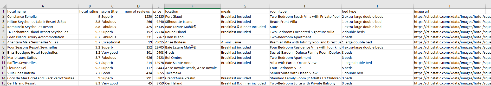
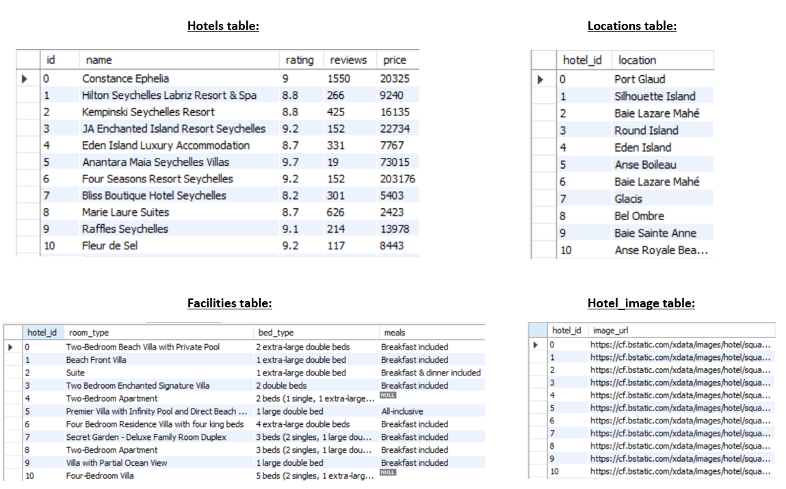

# Scraping Booking.com
This repository contains various files regarding web-scraping Booking.com.

## Installation
The program operates on any OS and uses python 3.8.3
* Creating a virtual environment by running:
    pip install -r requirements.txt
* Running Booking_scraper_main_code.py file:
    for details and more specific instructions, please see the Usage paragraph below.
      
     
## Usage
* The program scrapes data from booking.com website according to the user request.
The user chooses the destination, period of time and even can specify more search parameters to 
hers or his convenience. 
The scripts accepts several arguments from the user for proper usage:
    Mandatory (positional) arguments:
    1. Database name - The script will create a database in this name. if a database 
    with this name already exists, the script will continue to run and only a CSV file will be created 
    2. Destination - Where would like to travel? 
    3. Check-in - starting date of your travel **(yyyy-mm-dd)**
    4. Check-out - ending date of your travel **(yyyy-mm-dd)**  
    Optional arguments:
    5. Number of adults - You can specify how many adults take part in the travel.  
    E.g: --adults 2 (2 adults participate in the travel)
    **In case you would not specify any value, the default adults value will be 2**
    6. Number of children - You can specify how many children take part in the travel.  
    E.g: --children 2 (2 children participate in the travel)
    **In case you would not specify any value, the default children value will be 0**
    7. Number of rooms - You can specify how many rooms you would like to reserve.   
    **The number of rooms cannot exceed the specified number of adults,  in which case one 
    room will be taken into account**  
    E.g: --rooms 2 (2 rooms)
    **In case you would not specify any value, the default rooms value will be 1**
    8. MySQL host - for connecting to MySQL. The default is "localhost".  
    E.g: if you would like to change host, please insert: --host "another_host" 
    9. MySQL user - username for MySQL. The default is "root".  
    E.g: if you would like to change username, please insert: --user "root_root" 
    10. MySQL password - password for MySQL. The default is "root".  
    E.g: if you would like to change password, please insert:--password "1234". If you do not have a password please pass an empty string as ''
    An example for input: zanzibar_db "zanzibar" 2021-05-14 2021-05-18 --children 2 --password 1234
    This will search for hotels in zanzibar that are available between 14th to 18th of May 2021 for 2 adults (default)
    and 2 children. The connection to MySQL will use default values with "1234" as password and 
    the database that will be created will be named "zanzibar_db".
    Please pay attention that when inserting destination, use quotes("") so places with spaces in
    the name will be interpreted as one. E.g: "Tel Aviv"  
    An example of proper usage of parameters: python Booking_scraper_main_code.py zanzibar_db
      zanzibar 2021-10-04 2021-10-08 --children 2 --user username --password 1111

      
* The data is stored in two ways:
 1. A csv file and contain the hotel name, its rating, price,
 location, what meals are included, room details and a representative image of the listing.  
 Here is an example of an output CSV file:
 
  2. A database named by the user (see paragraph above)  
  The database contains four tables:
 a. Hotels - contains details regarding the hotel: name, rating, number of reviews and price.
 b. Facilities - contains details regarding what the hotel offers: room type, bed type and meals if included.
 c. Locations - contains details regarding the geographic location of the different hotels.
 d. Hotel_image - contains the hotel and its representative image (as a url).
 Please note that if the user chose a database name that already exists, the user will be notified
 and only a CSV file will be output. The user can run the script again with another database name 
 to receive also a database.  
 Here is an example of the created database tables:
 
 
 ## Content of the repository
 1. Booking_scraper_main_code.py - main code file 
 2. get_urls.py - a script containing the functions that retrieve the urls of all hotels found suitable for the specific search
 3. argparse_scraping.py - a script containing the function that receives arguments from the user into argparse module.
 4. scrape_requested_url.py - a script that outputs the final url for scraping according to user input. 
 5. mysql_db_scraper - a script containing a function that creates the database and empty tables.
 6. conf.json - a configuration file arranged as a json dictionary with constants used in the repository's files
 7. logging_file - a tracking file that follows the smooth and errorless progress of the scraping but also notifies errors and problems.
 8. test_Booking_scraper - a script that tests the main code. Please do not run is as a pytest file.
 9. test_get_urls - a pytest test file for validating the functions that are in charge of retrieve all the necessary urls.
 10. test_retrieve_func - a pytest test for validating the functions in charge of scraping various data from Booking.comm
 11. requirements.txt - the list of all necessary packages to install for proper usage.
 12. Booking_ERD - Entity relationship diagram the describes the database tables and their relationship to one another. 
 
## Disclaimer
Data fetched from booking is only for personal use, you are not
allowed to copy and paste content from Booking.com on to your own or third 
party pages (including social media pages such as Facebook, Twitter, Instagram etc.).

This applies to all types of content that can be found on Booking.com pages, 
including but not limited to hotel descriptions, reviews, hotel and room photos, 
hotel facility information, and prices.